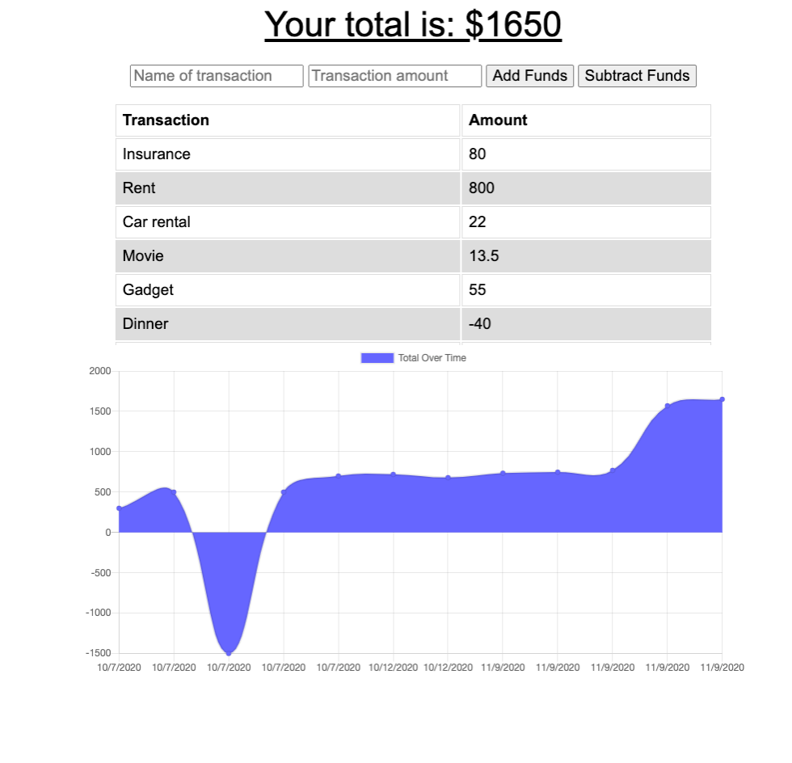

# UofT-budget-tracker
Budget-tracker is a web full-stack app developed to add expenses and deposits to their budget with or without a connection. When entering transactions offline, users should populate the total when brought back online.

## Features
* Offline Functionality:
    * Enter deposits offline
    * Enter expenses offline
* When brought back online:
    * Offline entries should be added to tracker.

## Use case
AS AN avid traveller
I WANT to be able to track my withdrawals and deposits with or without a data/internet connection
SO THAT my account balance is accurate when I am traveling

## Acceptance Criteria
GIVEN a user is on Budget App without an internet connection
WHEN the user inputs a withdrawal or deposit
THEN that will be shown on the page, and added to their transaction history when their connection is back online.

## Technology Stack
* Frontend (HTML, CSS, JavaScript)
* Backend (Node.js, Express, MongoDB, Mongoose)

## Demo
